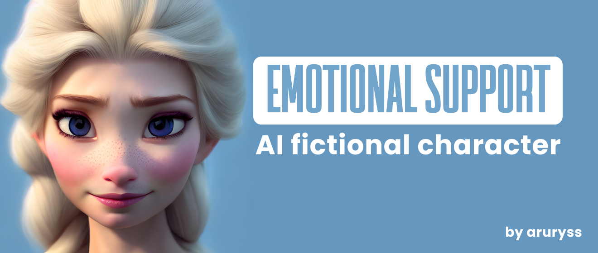

# AI Fictional Character Support Website
### Get encouraging message from your favourite movie/tv show/drama characters

## Authors

- [@aruryss](https://www.github.com/aruryss)
- This project was developed under the guidance of [build your own AI writing assistant w/ GPT-3](https://buildspace.so/builds/ai-writer) project from buildspace.

## Table of Contents

  - [Tech Stack](#tech-stack)
  - [How to run website locally](#How-to-run-website-locally)
  - [Future Improvements](#Future-Improvements)
  - [Repository structure](#Repository-structure)
##
I created a website that generates encouraging messages from your favourite movie / tv show / drama characters using OpenAI GPT-3.5.

## Tech Stack
- JavaScript
- HTML5
- CSS3
- OpenAI API

## How to run website locally

1. Clone repository to your machine

_Prerequisites:_
- Git Bash

Open Git Bash and redirect to the folder you want to clone this project to. Using ``` git clone ``` copy repository into specified folder:
```
cd YOUR_PATH_TO_FOLDER
git clone https://github.com/aruryss/ai-movie-character-support.git
```

2. Open command line in the folder specified earlier and run website locally

_Prerequisites:_
- Next JS
- React
- Yarn
- OpenAI API Key

```
cd YOUR_PATH_TO_FOLDER
yarn dev
```

Next, you need to create ```.env``` file in your repository with the following code:
```
OPENAI_API_KEY= YOUR_API_KEY_HERE
```
For that you will need an API key of your own. Create one here: https://platform.openai.com/api-keys. Save it, as you won't be able to copy it after completion of creation.

At the end, this will give you access to the website hosted locally through http://localhost:3000/
## Repository structure


```

├── assets
│   ├── ai.png                                    <- banner used in the README.
│   ├── buildspace-logo.png                       <- logo of buildspace used in the website
│
├── pages
│   ├── _app.js                                   <- react app.
│   ├── _document.js                              <- original website document.
│   ├── index.js                                  <- main page of the website.
│   ├── styles.css                                <- css document will all style components used in the website.
│   ├── api                                
    │   ├── generate.js                           <- "backend" that calls API and returns generated message.
│
├── public
│   ├── favicon.ico                               <- website favicon.
│   ├── vercel.svg                                <- vercel logo.
|
├── README.md                                     <- this readme file.
```
